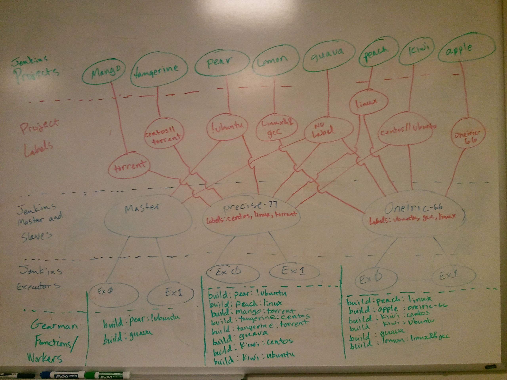
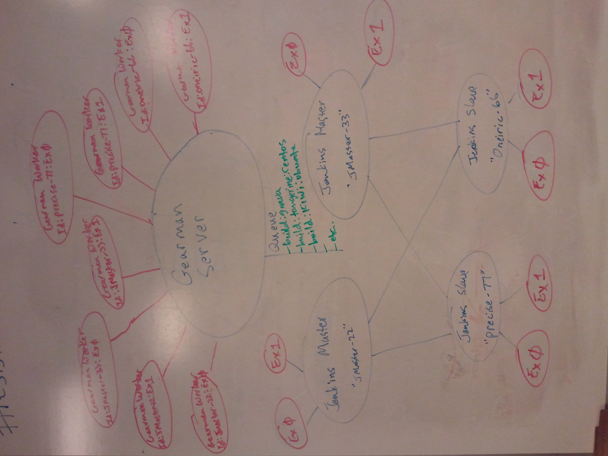

==============
Gearman Plugin
==============

Jenkins does not support multiple masters.  You can setup multiple Jenkins masters but there is no coordination between them.

One problem with scheduling builds on Jenkins master (“MasterA”) server is that MasterA only knows about its connected slaves.  If all slaves on MasterA are busy then MasterA will just put the next scheduled build on its queue.  Now MasterA needs to wait for an available slave to run the build.  This will be very in-efficient if your builds take a long time to run.  So.. what if there is another Jenkins master (“MasterB”) that has free slaves to service the next scheduled build? Your probably saying “Then slaves on MasterB should run the build”.  However MasterB will never service the builds on MasterA's queue.  The client that schedules the builds must know about MasterB and then schedule builds on MasterB. This is what we mean by lack of coordination between masters. This  gearman-plugin attempts to fill the gap.

This plugin integrates Gearman with Jenkins and will make it so that any Jenkins slave on any Jenkins master can service a job in the queue. It will essentially replace the Jenkins build queue with the Gearman job queue.  The job should stay in the gearman queue until there is a Jenkins node that can run that job.

This is the typical workflow:

  1. On a 'Launch Workers', we spawn a Gearman worker for each Jenkins executor.  We'll call these "executor worker threads". Each executor worker thread is associated 1:1 with a Jenkins executor
  2. Now we register jobs for each Gearman executor depending on projects, labels and nodes. View the below image to see how the projects get mapped to gearman functions.
  3. We spawn one more thread to be a Gearman worker to handle job management for this Jenkins master.  We'll call it the "management worker thread" and it will register a "stop:$hostname" function.
  4. Any Gearman client can connect to the Gearman server and send a request to build a Jenkins project or cancel a project.  View the Gearman client examples to see how this can be done.
  5. The Gearman workers will service any client request that come through to start and cancel a Jenkins build.

Developers
==========
Bug report:

 * https://bugs.launchpad.net/~gearman-plugin-core

Cloning:

 * https://github.com/openstack-infra/gearman-plugin.git

Patches are submitted via Gerrit at:

 * https://review.openstack.org/

More details on how you can contribute is available on our wiki at:

 * http://wiki.openstack.org/HowToContribute

